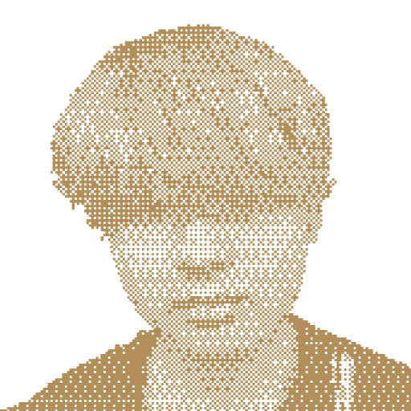

#  Vinxen

**통합 웹앱 빌더** - 레고 조립하듯 풀스택 웹앱 빌드

## 🚀 Quick Start

### CLI 사용법

```bash
# 프로젝트 생성
npx @vinxen/cli create my-app

# 또는 전역 설치
npm install -g @vinxen/cli
vinxen create my-app

# 프로젝트 시작
cd my-app
bun install
bun dev
```

## 📦 기능

- 🎯 **템플릿 기반 생성**: 사전 구성된 앱 템플릿 선택
- 📦 **모듈러 패키지**: 필요한 패키지만 조립
- ⚡ **Bun 기반**: 빠른 빌드와 실행
- 🔧 **풀스택 지원**: 프론트엔드부터 백엔드까지

## 🛠️ CLI 명령어

```bash
vinxen create [name]    # 새 프로젝트 생성
```

## 🎨 Frontend

Frontend 구성 예정

## 📚 개발 가이드

[개발 문서는 곧 추가될 예정입니다]

## 🤝 기여

이슈와 PR 환영합니다.